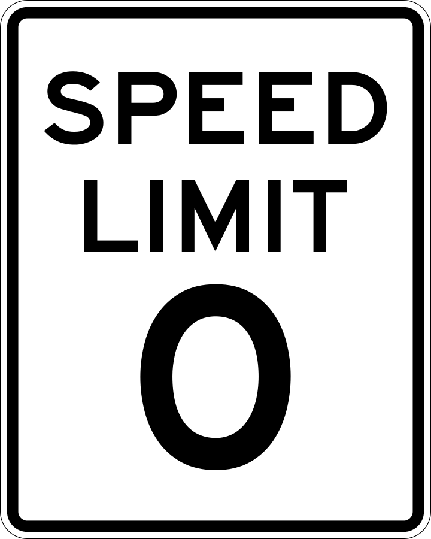
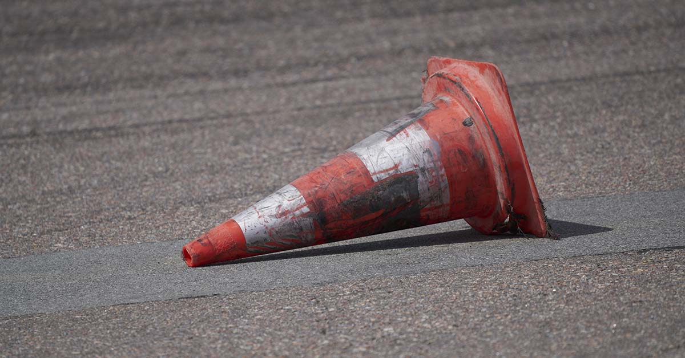

# Autonomous Backseat Driver
Generative AI can play an important role in any autonomous vehicle that operates in the open world, 
as a visual component that offers high-level commonsense directives to the vehicle, with the ability to offer explanations to the human operator of the vehicle.

This write-up is about the following topics:
* A live demo named [Autonomouse Backseat Driver](https://chat.openai.com/g/g-UpQkvuX7j-artistic-transformer) is made available through OpenAI's GPTs Store.
There a user can upload photo of a road scene, and the GPT will then return high-level driving directions along with the reasons for the suggestion.
* The information below also serves as the guide for the users of the said demo.
* Additional information are provided to people interested in pursuing this topic,
regarding how to select edge-case road scenes to test out OpenAI's GPT-4V model.
We also welcome people to test the data on other multi-modal LLMs.

## Background
As of December 2023, both the Google Gemini and OpenAI GPT-4V are multimodal, meaning that they are capable of extracting meaningful textual information from a given image. When compared the typical CNN-based vision system, 

We named such a component an **Autonomous Backseat Driver**, because we expect this component to offer only higher-level advices to the vehicle, while leaving the low-level controls to other components. This is needed because autonoumous navigation in most cases must operate in an open environment with endless unexpected conditions, and a vision component that is trained narrowly on very specific categories won't have the commonsense to deal with complex situations.

Fortunately for us, the latest multimodal large language models have shown great promise in achieve zero-shot-learning visual recognition for road conditions, and often are able to offer good advice with commonsense, along with an explanation for the given advice.

## Live Demo
You can try for yourself with an **Autonomous Backseat Driver** that we implemented using an OpenAI Custom GPT

What you could do with this Custom GPT:

- You proceed to find a suitable photo that shows a road scene from a driver's view
- Go to our Custom GPT, and upload the photo
- The Custom GPT will then return with a decision on whether the vehicle should proceed normally, slow down, stop, or turn around. An explanation for the decision will also be given. 

## Examples

Following are some examples, collected here to demonstrate a number of points:

* There are endless situation on the open road that need to be handled well by any autonomous vehicle.
* There are many confusing situations that require some level of commonsense reasoning in order to reach good decision.
* Important decisions should be explained.

Note that the emphasis in the responses below are mine.

### Example: Monster ahead

- **Notes**: extremely unusual scene. Testing sense of reality.
- **Response from OpenAI GPT-4**: This image appears to be a **fictional or altered scene**, as it shows a giant creature resembling a dinosaur in an urban setting, which does not exist in reality. In the context of the scenario you've asked me to provide advice on, **if this were a real situation**, it would constitute an extreme hazard.

    The recommended action would be to immediately stop the vehicle at a safe distance, and reverse or turn around if possible to evacuate the area. Contacting emergency services would be crucial...</td>

### Example: explosion ahead

- Notes: testing recognition of exceptional event
- Response from OpenAI GPT-4: This image depicts a large explosion in the form of a mushroom cloud, resembling a nuclear explosion, at the end of a long road.

    If this were a real situation, it would represent an extremely serious and life-threatening hazard. The appropriate response would be:

    - Immediate Evacuation: Do not drive towards the explosion. Turn around and drive away from the blast area as quickly as possible.
    - Seek Information: Tune into local radio or emergency services channels if possible to get information about what has happened and where to go.
    - Avoid Exposure: If you are within range of potential fallout, seek shelter immediately. This would typically be an underground area or a building made of thick, dense materials. Stay indoors, seal windows and doors, and wait for instructions from emergency services.
    - Protective Measures: If exposed to fallout, cover your mouth and nose with a mask or cloth to reduce inhalation of radioactive particles.
    - Contact Emergency Services: Once at a safe distance or in shelter, contact emergency services for further instructions.

    It is important to note that this response would be appropriate for a real nuclear event. However, the image provided is likely not a real scenario but a digital creation or a photo from a controlled test or movie scene. If you are ever unsure about whether a situation like this is real, it's crucial to seek information from reliable sources and follow official guidance.

### Example: tornado ahead

- Notes: unusual and extremely dangerous. Testing scenario never trained for, and commonsense reaction. 
- Response from OpenAI GPT-4: The image depicts a large tornado directly in the path of the road. Tornadoes are extremely dangerous and can cause catastrophic damage to vehicles, buildings, and the environment, as well as serious injury or loss of life.

    The immediate recommendation is to not proceed. Turn the vehicle around and drive away from the tornado at a right angle to its apparent path to seek immediate shelter. If you cannot quickly drive to a safe location, it's advised to exit the vehicle and find a low-lying area, such as a ditch, to lie down in, covering your head with your arms to protect yourself from flying debris and high winds. Do not seek shelter under overpasses or bridges, as these can create dangerous wind channels.

    It's also important to listen to weather alerts and have a plan for seeking shelter in case of severe weather like this. If you're in a region prone to tornadoes, keeping an emergency kit in your vehicle, including a first aid kit, water, food, and a portable weather radio, is advisable.

### Example: tornado on a commercial billboard 

- Notes: test distinction between real hazard and fictitious ones.
- Response from OpenAI GPT-4: The image shows a billboard advertising a place called "Naderville," which seems to be a reference to tornadoes, as indicated by the term 'nader, a colloquialism for "tornado." The billboard advertises "‘Nader Kits, Shelters and more," suggesting it is a business that sells emergency supplies and shelters for tornado protection.

    While the billboard itself does not present a direct hazard to drivers, it does serve as a reminder that the area is prone to tornadoes and that drivers should be prepared for such events. It's important for individuals in such regions to be aware of the weather conditions and have a plan for seeking shelter in case of a tornado warning.

    There are no actions required for the driver in relation to this billboard, but it would be wise to stay informed about the weather when driving in regions where tornadoes are common.

### Example: tornado warning sign

- Notes: testing recognition of non-standard warning sign, and recognition that this it is not a commercial
- Response from OpenAI GPT-4: The image shows a digital road sign with a message that reads "TORNADO WARNING FOR THIS AREA." A tornado warning indicates that a tornado has been sighted or indicated by weather radar, and there is an imminent danger to life and property.

    Here are the plausible serious hazards and recommended actions:

    - Immediate Tornado Threat: The warning suggests that a tornado may be very close. The hazard is the potential for the tornado to cross or impact the roadway, posing life-threatening danger to anyone outside of a secure shelter.
    - Debris: Tornadoes can carry debris which may be deposited on or near the roadway, creating driving hazards even if the tornado is not directly crossing the road.
    - Traffic: The warning may cause sudden or erratic driving behavior as people attempt to seek shelter, which can result in vehicular accidents.

    Recommendations:
    - If possible, exit the roadway and seek immediate shelter in a sturdy building, preferably in a basement or an interior room on the lowest floor with no windows.
    - Avoid seeking shelter under bridges or overpasses, as they do not provide protection from tornadoes and can create traffic hazards.
    - If there is no available shelter, a last-resort option is to park the car safely away from traffic lanes and lie flat in a low area covering your head and neck with your arms.
    - Keep a tornado survival kit in your vehicle, which includes items like a first aid kit, water, non-perishable food, a flashlight, and a portable weather radio.

    It's crucial to take immediate action upon seeing this sign and not to continue driving as if conditions are normal.

### Example: false positive tornado image

- Notes: test distinction between real warning signs, and commercials that should be ignored
- Response from OpenAI GPT-4: The image shows a billboard with a graphic that includes a tornado, which might be associated with a sports team or event in Kansas City. The content of the billboard does not indicate a real tornado threat or weather warning; it appears to be a form of advertisement or branding, perhaps for a sports team named the "Tornadoes."

    In this context, there are no immediate driving hazards present related to weather. However, as always, when driving:

    - Pay attention to the road and your surroundings, not the billboard.
    - Be mindful of other vehicles and pedestrians.
    - Follow all traffic signals and road signs.
    - Stay aware of weather conditions through reliable sources, especially if you are in an area prone to severe weather.

    It's important to differentiate between actual weather warnings and advertisements or symbols used in marketing. For real-time weather updates, one should rely on official weather channels, radio announcements, or mobile weather alerts.

### Example: pedestrian in the dark

- Notes: test recognition of pedestrians in low light
- Response from OpenAI GPT-4: The image shows a pedestrian crossing the street at a crosswalk at night. Here are the potential hazards and the recommended action:

    Hazards:
  
    - Pedestrian in the Roadway: The person crossing the street is the primary concern. At night, visibility is reduced, and the pedestrian might not be easily seen by drivers.
    - Low Light Conditions: Given that it is nighttime, there may be a reduced ability for drivers to see and react to road conditions and pedestrians.

    Recommendations:

    - Reduce Speed: Slow down when approaching crosswalks, especially in low light conditions.
    - Yield to Pedestrians: Be prepared to stop if necessary to allow the pedestrian to cross safely.
    - Stay Vigilant: Keep an eye out for other pedestrians who may also be trying to cross the street, as there could be more people outside the field of view of this image.
    - Use Headlights: Make sure your vehicle's headlights are on and properly adjusted to ensure maximum visibility without blinding other road users.
  
### Example: downed trees

- Notes: severe road hazard
- Response from OpenAI GPT-4: In the image, there are several serious hazards present:

    Fallen Tree: A large tree has fallen across the road, completely blocking passage. This poses a direct physical barrier to vehicles.

    Downed Power Lines: The fallen tree has brought down power lines, which are potentially live and represent a significant electrocution risk.

    Road Debris: Smaller branches and debris from the tree are scattered across the road, posing additional risks for tire damage and vehicle stability.

    The recommended action is to stop the vehicle at a safe distance from the fallen tree and downed power lines. Do not attempt to drive over or around the debris. Turning around and finding an alternate route would be the safest course of action. Additionally, it's crucial to alert the local authorities to the fallen tree and downed power lines so that they can safely clear the road and repair any damage. It's also important to warn other drivers of the hazard if possible.

### Example: complex sign with social warnings

- Notes: this is not directly related the control of a vehicle, but it serves to test whether the system is able to recognize cues in a potentially dangerous environment. 
- Response from OpenAI GPT-4: The image shows a safety alert sign warning of a "Smash and Grab" hotspot, which indicates a high incidence of theft from vehicles in the area. Here are the hazards and recommendations:

    Hazards:
  
    - Risk of theft from vehicles, potentially leading to loss of valuables and damage to the vehicle.
    - Possible vehicle break-in, which could involve window smashing and the associated cost and inconvenience of repairs.
    - Personal safety may be at risk if encountering thieves in the act.

    Recommendations:

    - Take all electronics, purses, bags, and valuables with you when leaving your vehicle.
    - Leave nothing of value visible inside the vehicle to deter potential theft.
    - If you must leave items in the vehicle, ensure they are well hidden from view.
    - Be vigilant and report any suspicious activity to the US Park Police using the provided contact number.

    Remember: taking proactive steps to secure your belongings can significantly reduce the risk of theft.

### Example: road closed

- Notes: testing inpassable driving condition
- Response from OpenAI GPT-4: The image shows a clear hazard: the road is closed, indicated by multiple signs and barriers. Here's the appropriate action based on this scene:

    - Do Not Proceed: The "ROAD CLOSED" signs are unmistakable indicators that the road ahead is not safe or permissible for travel. You should not attempt to go around or move the barriers.
    - Turn Around Safely: Find a safe place to turn around and seek an alternate route. Use a GPS or a map to find another way to your destination.
    - Inform Authorities (if applicable): If you happen to be the first to encounter this without prior warning, it might be helpful to report the road closure to local authorities, especially if it seems like an immediate or unexpected hazard.

    The closure could be due to various reasons such as road work, an accident, or a natural disaster. It's important to respect these closures for your own safety and to remain within the law.

### Example: lane closure

- Notes: test road condition that requires caution. GPT-4 seems to recognize the **wrong lane** as closed.
- Response from OpenAI GPT-4: In this image, we see a road maintenance operation underway, with the **right lane** closed off by traffic cones and maintenance vehicles present.

    Hazards:
    - Lane Closure: The right lane is closed, necessitating a merge into the open lane to continue safely.
    - Maintenance Vehicles and Workers: Presence of road work crew and vehicles poses a risk if not navigated cautiously.
    Recommendations:
    - Merge Safely: Signal early and merge into the open lane as soon as possible before reaching the lane closure.
    - Reduce Speed: Follow any posted speed limit reductions and be prepared to stop if necessary.
    - Stay Alert: Watch for any workers who may be near the traffic lanes and for sudden movements of maintenance vehicles.
    - Maintain a Safe Distance: Keep a safe following distance from the vehicle in front of you, as well as from the maintenance vehicles and workers.
    
    Road work can create unpredictable driving conditions, so it is important to remain vigilant and drive defensively through the work zone.

### Example: too many signs

- Notes: test ability to read complex signs and reason with it
- Response from OpenAI GPT-4: The image shows a complex array of parking signs with various restrictions:

    - No Parking from 11 AM to 1 PM on Tuesdays for street cleaning.
    - Tow-away zone with no stopping on school days from Monday to Friday between 7:30 AM and 4 PM.
    - 15-minute parking for school business on school days from Monday to Friday between 7:30 AM and 8 AM.
    - 1-hour parking on school days from Monday to Friday between 4 PM and 6 PM.
    - Vehicles with district permits are exempt from these restrictions.

    The layered restrictions indicate that parking regulations change throughout the day and week, likely to accommodate school traffic and street cleaning schedules. These signs require careful attention to ensure you're not parked illegally at any time, which could result in fines or your vehicle being towed.

    If you're driving in this area, you need to be aware of these restrictions and plan accordingly, especially if you intend to park. Always double-check the current time, the day of the week, and whether school is in session to comply with the regulations. If in doubt, find an alternative place to park where the rules are less restrictive and clearer.
- Follow-up Q&A:
    - Q: it is 2pm Saturday right now, can I park here?
    - A: Based on the information provided in the image and the fact that it is 2 PM on a Saturday, none of the restrictions mentioned on the signs apply:

        - The "No Parking" is only for Tuesday from 11 AM to 1 PM.
        - The "No Stopping" and parking time limits apply on school days (Monday through Friday).

        Therefore, you should be able to park at this location at 2 PM on a Saturday without violating the restrictions shown. However, always be sure to observe any other possible restrictions that may not be visible in the image or any temporary restrictions that may be in place.

### Example: unreasonable traffic sign

- Notes: test whether system has the commonsense to no obey unreasonable traffic sign
- Response from OpenAI GPT-4: The image appears to show a speed limit sign with the number "0" on it. This sign is not practical for normal traffic conditions since a speed limit of "0" miles per hour would mean no movement is allowed. This could be a sign that has been altered for humorous purposes or represents an artistic or symbolic message rather than an actual traffic control device.

    In a real-world scenario, if you encounter a sign that you believe is incorrect or seems to be a mistake, you should not follow it literally. Instead, drive at a speed that is safe for the road conditions and in accordance with the typical legal speed limits for the area, while seeking further clarification from local traffic authorities if possible.

### Example: standing water or sink hole?

- Notes: somehow GPT-4 sees the hazard as a sinkhole. I initially thought that it is a puddle of water, and only after very careful examination that I had to agree that GPT-4 was right after all. 
- Response from OpenAI GPT-4: In this image, we see a road that has been severely compromised by a sinkhole, which is a significant road hazard. Here's how to address this situation:

    - Stop the Vehicle: Immediately reduce your speed and come to a stop at a safe distance from the sinkhole.
    - Do Not Attempt to Cross: The sinkhole presents a clear danger, and attempting to cross could result in vehicle damage or a life-threatening situation if the road were to collapse further.
    - Turn Around Safely: Once stopped and it's safe to do so, carefully turn the vehicle around and find an alternate route.
    - Report the Hazard: Inform the local authorities about the road hazard so that they can take appropriate actions to repair the road and set up warnings for other drivers.
    - Alert Other Drivers: If you have a way to warn other drivers, such as hazard lights or if you can place warning devices at a safe distance before the hazard, do so to prevent others from approaching the danger.

### Example: uncommon traffic sign

- Notes: this is an uncommon traffic sign, meant to test the system breath of knowledge without further training.
- Response from OpenAI GPT-4: The image displays a traffic sign indicating "LOW SALT AREA NEXT 9 MILES." This sign warns drivers that for the next nine miles, the road will not be treated with as much road salt as might normally be expected in icy or snowy conditions.

    The hazard in this situation is the increased potential for slippery road conditions, especially during or after winter precipitation when roads are typically salted to melt ice and snow.

    Recommendations for driving in this area:

    - Reduce Speed: Drive more slowly than you would under normal conditions, particularly if the weather is cold and there may be ice.
    - Increase Following Distance: Leave more space between your vehicle and the one in front of you to allow for longer stopping distances on potentially slick roads.
    - Avoid Sudden Maneuvers: Be smooth with steering, braking, and accelerating to avoid losing control on slippery surfaces.
    - Stay Alert: Pay attention to how your vehicle is responding to the road and be ready to react to slippery spots.
    - Use Proper Tires: If you're in an area that experiences winter weather, ensure you have tires that are appropriate for those conditions.

    Always heed local advisories and be prepared for changing road conditions, especially in areas known for less road treatment during winter weather events.

### Example: inflatable minion on road 

- Notes: this tests if system knows how to respond to unusual and unique road hazard.
- Response from OpenAI GPT-4: The image shows an oversized inflatable object, which appears to be a large minion character, obstructing the roadway. This is a unique and unexpected road hazard.

    Here are the hazards and recommended actions:

    Hazards:

    - Road Obstruction: The large inflatable is blocking the road, potentially causing traffic to stop or slow down unexpectedly.
    - Driver Distraction: The unusual sight might distract drivers, increasing the risk of accidents due to inattention.
    - Sudden Braking: Vehicles ahead may brake suddenly to avoid the obstruction, requiring quick reactions from all following drivers.

    Recommended Actions:

    - Reduce Speed: Slow down immediately to allow more time to react.
    - Increase Following Distance: Allow more space between your vehicle and the one ahead to provide more stopping distance.
    - Stay Alert: Be prepared for unexpected actions from other drivers who are also reacting to the obstruction.
    - Obey Traffic Signals: If traffic is being directed by police or temporary road signs, follow their directions.
    - Do Not Attempt to Overtake: It is not safe to try to overtake or go around the obstruction unless it is clear and safe to do so.

    In this scenario, the priority is to avoid contributing to potential accidents by staying alert and prepared for sudden stops. If safe to do so, reporting the hazard to the proper authorities would also be advisable so they can remove the obstruction and restore normal traffic flow.

### Example: dangling wire 

- Notes: testing the recognition of the barely visible dangling wire, and the potential hazard that it poses.
- Response from OpenAI GPT-4: The image shows a street light or traffic signal that has become dislodged and is hanging low over the roadway, posing a significant hazard. This is especially dangerous at night when visibility is reduced.

    Here are the hazards and recommended actions:

    Hazards:

    - Low-Hanging Obstruction: The hanging object could potentially collide with taller vehicles, causing damage or secondary accidents.
    - Electrical Hazard: If the object is part of the electrical infrastructure, there could be live wires posing a risk of electrocution or fire.
    - Distraction: The unusual sight might distract drivers, which could lead to accidents.

    Recommended Actions:

    - Slow Down: Reduce your speed significantly to safely navigate around the hazard.
    - Change Lanes: If it's safe to do so, and you're on a multi-lane road, switch to a lane further away from the hanging object.
    - Use Hazard Lights: Activate your vehicle’s hazard lights to alert other drivers to the potential danger.
    - Do Not Touch: Never attempt to move or touch downed electrical equipment or wires.
    - Report the Hazard: Contact local authorities or emergency services to report the road hazard so that it can be dealt with safely and promptly.

    Always maintain a safe following distance to allow time for sudden stops, and be ready to react to the actions of drivers ahead who may also be responding to the hazard.

### Example: single knocked-over traffic cone

- Notes: testing whether this system has the commonsense to go around a single knocked-over traffic cone, which likely is not meant as a sign to block vehicles
- Response from OpenAI GPT-4: The image displays a traffic cone that has been knocked over onto the road. While it may not block the path entirely, it still poses a potential hazard to drivers.

    Hazards:

    - Road Obstacle: The fallen cone is an obstacle that vehicles need to avoid, which could lead to sudden lane changes or swerving.
    - Indication of an Issue: The cone might have been marking a specific hazard on the road, such as a pothole, debris, or an area of construction, which could still be present.

    Recommended Actions:

    - Slow Down: Reduce speed as you approach the cone to give yourself more time to react.
    - Avoid the Cone: Safely navigate around the cone, ensuring that you check surrounding traffic to do so safely.
    - Scan for Further Hazards: Look for any additional signs of why the cone was there in the first place, such as road work or a specific hazard on the road.
    - Do Not Attempt to Re-position the Cone: It’s unsafe to exit your vehicle on a busy road to upright the cone.

    If it's safe to do so, reporting the fallen cone to local authorities or road maintenance can help ensure the hazard is addressed and the cone is put back in place or removed as necessary.

### Example: traffic cones in a corner

- Notes: testing whether this system will get confused by some traffic cones placed in a corner 
- Response from OpenAI GPT-4: The image shows three traffic cones placed on a paved area next to a parked red car. This setting suggests a controlled environment, perhaps a driveway or a private parking area.

    While the cones may not present an immediate driving hazard since the vehicle is parked and the cones are off to the side, they could signify a few things:

    - Reserved Parking: The cones may be used to reserve a parking spot or to indicate that parking is not allowed in that particular space.
    - Proximity Alert: They could be placed to warn the car driver not to reverse further or to mark a boundary for parking.
    - Potential Obstacle: If the car is to be moved, the driver should be careful not to hit the cones.

    In this context, no specific action is needed since the car is parked. However, if the driver intends to move the car, they should remove the cones before doing so to prevent driving over them. It's also important to ensure that moving the cones is permissible, as they might be there for a specific reason, such as roadwork nearby or to cordon off a restricted

### Example: adversarial traffic sign

- Notes: this is an adversarial traffic sign designed by University of Washington in 2017, which was reported to cause a driverless car to misread it as a '45' speed limit sign. GPT-4 fully recognizes what it really is, and suggested proper action.
- Response from OpenAI GPT-4: The image displays a modified stop sign that has been altered to include the words "LOVE" and "HATE," creating a message that reads "LOVE STOP HATE." This alteration is a form of statement or public art and is not an official traffic sign.

    While the original intent of the sign is to instruct drivers to come to a complete stop, the added text transforms it into a message likely intended to promote love and end hate. If this sign is placed on a road, it could potentially confuse drivers due to the additional text. However, the primary function of the stop sign, indicated by its shape and color, is still clear: drivers should come to a complete stop at the sign.

    For traffic safety, it is crucial that official road signs remain unaltered and clearly legible to prevent any misunderstandings on the road. If you come across a sign like this while driving, follow the traffic rules that apply to standard stop signs while also being aware of the possibility of other drivers being distracted or confused by the unconventional message.

<!--
### Example: 

- Notes: 
- Response from OpenAI GPT-4: 
-->

