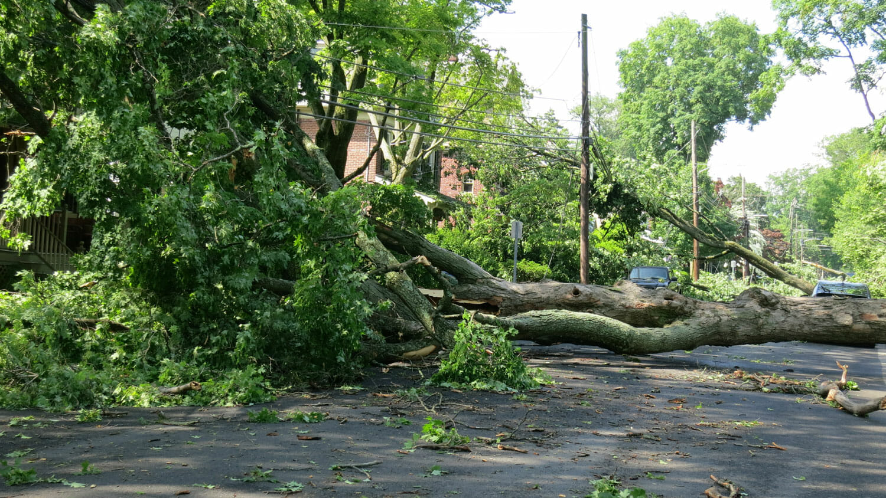
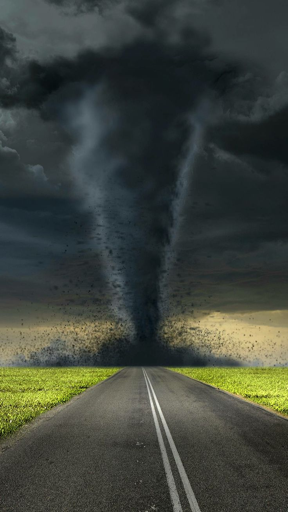

# Autonomous Backseat Driver
Generative AI can play an important role in any autonomous vehicle that operates in the open world, 
as a visual component that offers high-level commonsense directives to the vehicle, with the ability to offer explanations to the human operator of the vehicle.

This write-up is about the following topics:
* A live demo named [Autonomouse Backseat Driver](https://chat.openai.com/g/g-UpQkvuX7j-artistic-transformer) is made available through OpenAI's GPTs Store.
There a user can upload photo of a road scene, and the GPT will then return high-level driving directions along with the reasons for the suggestion.
* The information below also serves as the guide for the users of the said demo.
* Additional information are provided to people interested in pursuing this topic,
regarding how to select edge-case road scenes to test out OpenAI's GPT-4V model.
We also welcome people to test the data on other multi-modal LLMs.

## Background
As of December 2023, both the Google Gemini and OpenAI GPT-4V are multimodal, meaning that they are capable of extracting meaningful textual information from a given image. When compared the typical CNN-based vision system, 

We named such a component an **Autonomous Backseat Driver**, because we expect this component to offer only higher-level advices to the vehicle, while leaving the low-level controls to other components. This is needed because autonoumous navigation in most cases must operate in an open environment with endless unexpected conditions, and a vision component that is trained narrowly on very specific categories won't have the commonsense to deal with complex situations.

Fortunately for us, the latest multimodal large language models have shown great promise in achieve zero-shot-learning visual recognition for road conditions, and often are able to offer good advice with commonsense, along with an explanation for the given advice.

## Live Demo
You can try for yourself with an **Autonomous Backseat Driver** that we implemented using an OpenAI Custom GPT

What you could do with this Custom GPT:

- You proceed to find a suitable photo that shows a road scene from a driver's view
- Go to our Custom GPT, and upload the photo
- The Custom GPT will then return with a decision on whether the vehicle should proceed normally, slow down, stop, or turn around. An explanation for the decision will also be given. 

## Examples

Following are some examples, collected here to demonstrate a number of points:

* There are endless situation on the open road that need to be handled well by any autonomous vehicle.
* There are many confusing situations that require some level of commonsense reasoning in order to reach good decision.
* Important decisions should be explained.

### Monster ahead

    - Notes: extremely unusual scene
    - Response from OpenAI GPT-4: This image appears to be a fictional or altered scene, as it shows a giant creature resembling a dinosaur in an urban setting, which does not exist in reality. In the context of the scenario you've asked me to provide advice on, if this were a real situation, it would constitute an extreme hazard.

    The recommended action would be to immediately stop the vehicle at a safe distance, and reverse or turn around if possible to evacuate the area. Contacting emergency services would be crucial...</td>

### Downed trees

- Notes: Severe road hazard
- Response from OpenAI GPT-4: In the image, there are several serious hazards present:

    Fallen Tree: A large tree has fallen across the road, completely blocking passage. This poses a direct physical barrier to vehicles.

    Downed Power Lines: The fallen tree has brought down power lines, which are potentially live and represent a significant electrocution risk.

    Road Debris: Smaller branches and debris from the tree are scattered across the road, posing additional risks for tire damage and vehicle stability.

    The recommended action is to stop the vehicle at a safe distance from the fallen tree and downed power lines. Do not attempt to drive over or around the debris. Turning around and finding an alternate route would be the safest course of action. Additionally, it's crucial to alert the local authorities to the fallen tree and downed power lines so that they can safely clear the road and repair any damage. It's also important to warn other drivers of the hazard if possible.

<table>
  <tr>
    <td>
      
    </td>
    <td>
      Tornado ahead. This tests the recognition of unusual but dangerous situation.
        Correct response is to turn around.
    </td>
    <td></td>
    <td></td>
  </tr>
</table>
