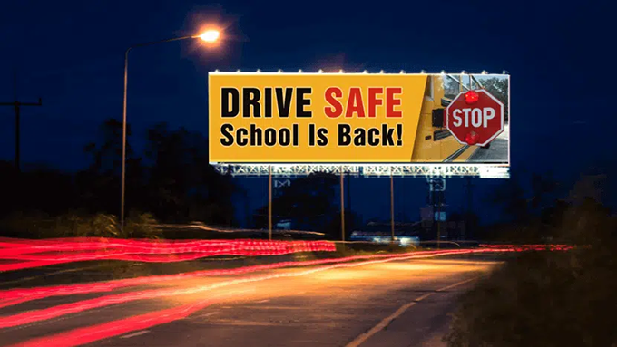

# Autonomous Backseat Driver
This writeup explains how Generative AI can be used in an autonomous vehicle, as a visual commonsense component that offers high-level directives to the vehicle.

## Background
As of December 2023, both the Google Gemini and OpenAI GPT-4 are multimodal, meaning that they are capable of extracting meaningful textual information from a given image. When compared the typical CNN-based vision system, 

We name such a component an **Autonomous Backseat Driver**, because we expect this component to offer only higher-level advices to the vehicle, while leaving the low-level controls to other components. This is needed because autonoumous navigation in most cases must operate in an open environment with endless unexpected conditions, and a vision component that is trained narrowly on very specific categories won't have the commonsense to deal with complex situations.

Fortunately for us, the latest multimodal large language models have shown great promise in achieve zero-shot-learning visual recognition for road conditions, and often are able to offer good advice with commonsense, along with an explanation for the given advice.

## Live Demo
You can try for yourself with an **Autonomous Backseat Driver** that we implemented using an OpenAI Custom GPT

What you could do with this Custom GPT:

- You proceed to find a suitable photo that shows a road scene from a driver's view
- Go to our Custom GPT, and upload the photo
- The Custom GPT will then return with a decision on whether the vehicle should proceed normally, slow down, stop, or turn around. An explanation for the decision will also be given. 

## Examples

Following are some examples, collected here to demonstrate a number of points:

* There are endless situation on the open road that need to be handled well by any autonomous vehicle.
* There are many confusing situations that require some level of commonsense reasoning in order to reach good decision.
* Important decisions should be explained.

<table>
  <tr>
    <td>
      
    </td>
    <td>
      This shows a fake stop sign on a billboard. Correct reaction is to ignore it.
    </td>
  </tr>
  <tr>
    <td>
      
    </td>
    <td>
      Tornado ahead. Correct reaction is to turn around.
    </td>
  </tr>
</table>
