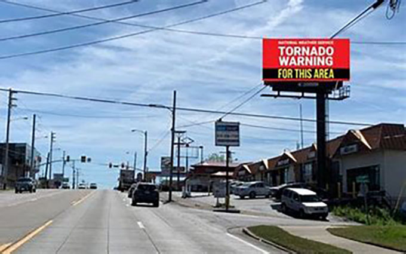
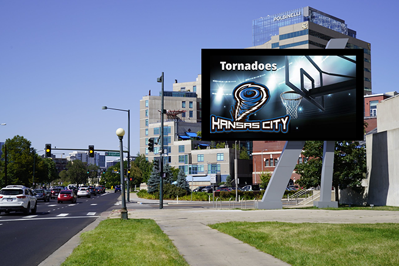

# Autonomous Backseat Driver
Generative AI can play an important role in any autonomous vehicle that operates in the open world, 
as a visual component that offers high-level commonsense directives to the vehicle, with the ability to offer explanations to the human operator of the vehicle.

This write-up is about the following topics:
* A live demo named [Autonomouse Backseat Driver](https://chat.openai.com/g/g-UpQkvuX7j-artistic-transformer) is made available through OpenAI's GPTs Store.
There a user can upload photo of a road scene, and the GPT will then return high-level driving directions along with the reasons for the suggestion.
* The information below also serves as the guide for the users of the said demo.
* Additional information are provided to people interested in pursuing this topic,
regarding how to select edge-case road scenes to test out OpenAI's GPT-4V model.
We also welcome people to test the data on other multi-modal LLMs.

## Background
As of December 2023, both the Google Gemini and OpenAI GPT-4V are multimodal, meaning that they are capable of extracting meaningful textual information from a given image. When compared the typical CNN-based vision system, 

We named such a component an **Autonomous Backseat Driver**, because we expect this component to offer only higher-level advices to the vehicle, while leaving the low-level controls to other components. This is needed because autonoumous navigation in most cases must operate in an open environment with endless unexpected conditions, and a vision component that is trained narrowly on very specific categories won't have the commonsense to deal with complex situations.

Fortunately for us, the latest multimodal large language models have shown great promise in achieve zero-shot-learning visual recognition for road conditions, and often are able to offer good advice with commonsense, along with an explanation for the given advice.

## Live Demo
You can try for yourself with an **Autonomous Backseat Driver** that we implemented using an OpenAI Custom GPT

What you could do with this Custom GPT:

- You proceed to find a suitable photo that shows a road scene from a driver's view
- Go to our Custom GPT, and upload the photo
- The Custom GPT will then return with a decision on whether the vehicle should proceed normally, slow down, stop, or turn around. An explanation for the decision will also be given. 

## Examples

Following are some examples, collected here to demonstrate a number of points:

* There are endless situation on the open road that need to be handled well by any autonomous vehicle.
* There are many confusing situations that require some level of commonsense reasoning in order to reach good decision.
* Important decisions should be explained.

Note that the emphasis in the responses below are mine.

### Example: Monster ahead

- **Notes**: extremely unusual scene. Testing sense of reality.
- **Response from OpenAI GPT-4**: This image appears to be a **fictional or altered scene**, as it shows a giant creature resembling a dinosaur in an urban setting, which does not exist in reality. In the context of the scenario you've asked me to provide advice on, **if this were a real situation**, it would constitute an extreme hazard.

    The recommended action would be to immediately stop the vehicle at a safe distance, and reverse or turn around if possible to evacuate the area. Contacting emergency services would be crucial...</td>

### Example: tornado on a billboard commercial

- Notes: test distinction between real hazard and fictitious ones.
- Response from OpenAI GPT-4: The image shows a billboard advertising a place called "Naderville," which seems to be a reference to tornadoes, as indicated by the term 'nader, a colloquialism for "tornado." The billboard advertises "‘Nader Kits, Shelters and more," suggesting it is a business that sells emergency supplies and shelters for tornado protection.

    While the billboard itself does not present a direct hazard to drivers, it does serve as a reminder that the area is prone to tornadoes and that drivers should be prepared for such events. It's important for individuals in such regions to be aware of the weather conditions and have a plan for seeking shelter in case of a tornado warning.

    There are no actions required for the driver in relation to this billboard, but it would be wise to stay informed about the weather when driving in regions where tornadoes are common.

### Example: tornado ahead

- Notes: unusual and extremely dangerous. Testing scenario never trained for, and commonsense reaction. 
- Response from OpenAI GPT-4: The image depicts a large tornado directly in the path of the road. Tornadoes are extremely dangerous and can cause catastrophic damage to vehicles, buildings, and the environment, as well as serious injury or loss of life.

    The immediate recommendation is to not proceed. Turn the vehicle around and drive away from the tornado at a right angle to its apparent path to seek immediate shelter. If you cannot quickly drive to a safe location, it's advised to exit the vehicle and find a low-lying area, such as a ditch, to lie down in, covering your head with your arms to protect yourself from flying debris and high winds. Do not seek shelter under overpasses or bridges, as these can create dangerous wind channels.

    It's also important to listen to weather alerts and have a plan for seeking shelter in case of severe weather like this. If you're in a region prone to tornadoes, keeping an emergency kit in your vehicle, including a first aid kit, water, food, and a portable weather radio, is advisable.

### Example: tornado warning sign

- Notes: testing recognition of non-standard warning sign, and recognition that this it is not a commercial
- Response from OpenAI GPT-4: The image shows a digital road sign with a message that reads "TORNADO WARNING FOR THIS AREA." A tornado warning indicates that a tornado has been sighted or indicated by weather radar, and there is an imminent danger to life and property.

    Here are the plausible serious hazards and recommended actions:

        Immediate Tornado Threat: The warning suggests that a tornado may be very close. The hazard is the potential for the tornado to cross or impact the roadway, posing life-threatening danger to anyone outside of a secure shelter.

        Debris: Tornadoes can carry debris which may be deposited on or near the roadway, creating driving hazards even if the tornado is not directly crossing the road.

        Traffic: The warning may cause sudden or erratic driving behavior as people attempt to seek shelter, which can result in vehicular accidents.

    Recommendations:

        If possible, exit the roadway and seek immediate shelter in a sturdy building, preferably in a basement or an interior room on the lowest floor with no windows.
        Avoid seeking shelter under bridges or overpasses, as they do not provide protection from tornadoes and can create traffic hazards.
        If there is no available shelter, a last-resort option is to park the car safely away from traffic lanes and lie flat in a low area covering your head and neck with your arms.
        Keep a tornado survival kit in your vehicle, which includes items like a first aid kit, water, non-perishable food, a flashlight, and a portable weather radio.

    It's crucial to take immediate action upon seeing this sign and not to continue driving as if conditions are normal.

### Example: false positive tornado image

- Notes: test distinction between real warning signs, and commercials that should be ignored
- Response from OpenAI GPT-4: The image shows a billboard with a graphic that includes a tornado, which might be associated with a sports team or event in Kansas City. The content of the billboard does not indicate a real tornado threat or weather warning; it appears to be a form of advertisement or branding, perhaps for a sports team named the "Tornadoes."

    In this context, there are no immediate driving hazards present related to weather. However, as always, when driving:

    -Pay attention to the road and your surroundings, not the billboard.
    - Be mindful of other vehicles and pedestrians.
    - Follow all traffic signals and road signs.
    - Stay aware of weather conditions through reliable sources, especially if you are in an area prone to severe weather.

    It's important to differentiate between actual weather warnings and advertisements or symbols used in marketing. For real-time weather updates, one should rely on official weather channels, radio announcements, or mobile weather alerts.
  
### Example: Downed trees

- Notes: severe road hazard
- Response from OpenAI GPT-4: In the image, there are several serious hazards present:

    Fallen Tree: A large tree has fallen across the road, completely blocking passage. This poses a direct physical barrier to vehicles.

    Downed Power Lines: The fallen tree has brought down power lines, which are potentially live and represent a significant electrocution risk.

    Road Debris: Smaller branches and debris from the tree are scattered across the road, posing additional risks for tire damage and vehicle stability.

    The recommended action is to stop the vehicle at a safe distance from the fallen tree and downed power lines. Do not attempt to drive over or around the debris. Turning around and finding an alternate route would be the safest course of action. Additionally, it's crucial to alert the local authorities to the fallen tree and downed power lines so that they can safely clear the road and repair any damage. It's also important to warn other drivers of the hazard if possible.

### Example: 

- Notes: 
- Response from OpenAI GPT-4: 
  
