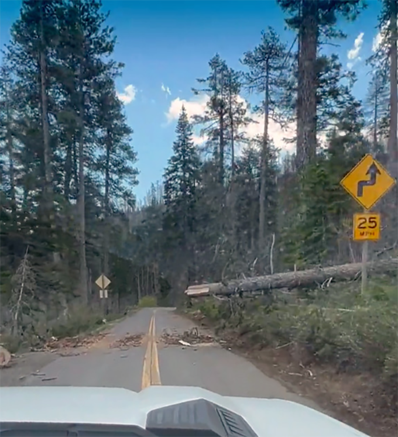
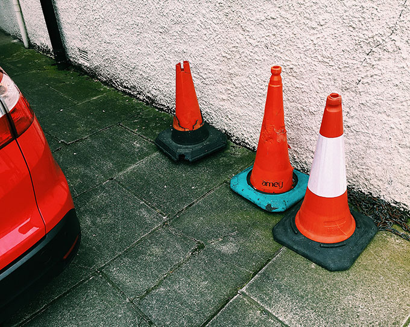
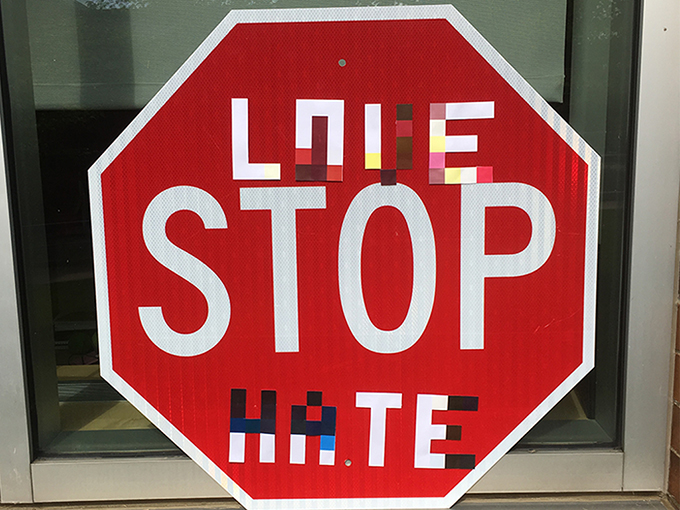
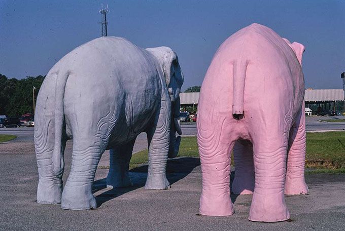
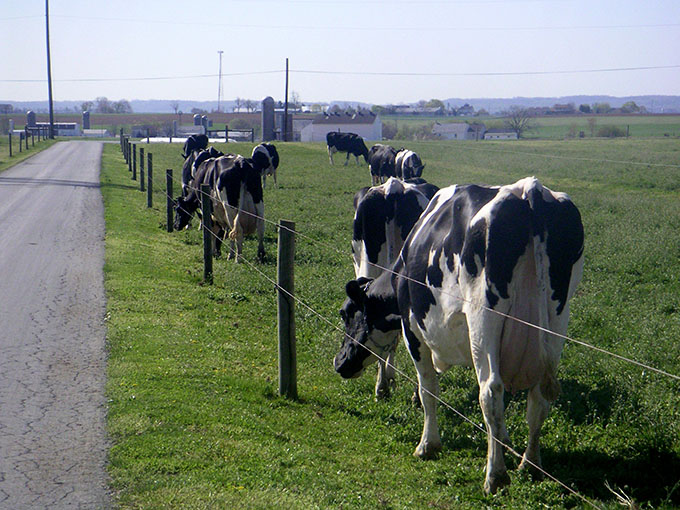
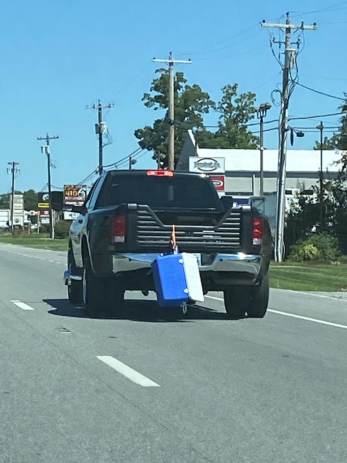

# Evaluating Multimodal LLM's Use in Autonomous Driving

*last updated February 1, 2024*

This article introduces a set of test scenarios aimed at gauging the performance of a multimodal Large Language Model (LLM) within the scope of **real-world autonomous driving**. In these scenarios, the LLM takes on the role of a driver, is required to react appropriately to various road situations represented in images, and provide justifications for its decisions.

The primary objective of these tests is to evaluate the LLM’s capacity to produce **commonsense reactions to unusual circumstances**. The overarching goal is to determine if the commonsense knowledge embedded within a multimodal LLM is adequate for practical use, not just in autonomous driving, but in broader applications as well.

Many of these test cases pose challenges for traditional computer vision systems, which are generally trained on predefined categories. These scenarios represent the [**long-tail cases**](https://spectrum.ieee.org/autonomous-cars-vs-kangaroos-the-long-furry-tail-of-unlikely-events) that fall outside the scope of the training data and often prove problematic for traditional approaches.

If a multimodal LLM can successfully handle most of these test scenarios, it can be deemed to have the necessary **road commonsense** to function in the unpredictable real world. This also implies that it could be a useful additional element in an autonomous vehicle system.

## Test Summary

Following is a quick summary of the tests. Overall the GPT-4V model has performed very well in the following scenarios:

* Distinguish fantasy from reality (Gozilla on the road, flying DeLorean in front, etc.).
* Recognize tornado on a billboard commercial as false positive, while a tornado alert on a digital display is correctly identified as true warning.
* Spot pedestrian in crosswalk under low light situation.
* Read and fully understanding complex signs with lots of text, including non-driving signs such as the [smash and grab](#user-content-case-complex-sign-with-social-warnings) case.
* Reason against complex signs and answer interactive queries correctly (see case [too many signs](#user-content-case-too-many-signs))
* Ignore impossible road sign (such as speed limit of 0)
* Understanding uncommon warning signs (such as the 'low salt' sign)
* Appropriate handling of unusual hazard (e.g., giant inflatable object blocking road, dangling electrical wire, nearly invisible overturned trailer, etc.)
* Work around doubtful traffic sign (such as a singular knocked-over traffic cone)
* Doesn't get distracted by inconsequential traffic signs (e.g., traffic cones in a corner)
* Doesn't get confused by adversarial traffic signs.
* Infer likely hazard from visual clue before it occurs, such as in the [unsecured cooler](#user-content-case-unsecured-cooler) case.

Following are cases where GPT-4V has performed less than stellar:

* In the [lane closure](#user-content-case-lane-closure) case, GPT-4V mistakenly indicated that the **right lane** was closed when it should be the **left lane**. 
* In the [wrong way](#user-content-case-wrong-way) case, GPT-4V has failed to spot that there is a car driving in the wrong direction in its initial response. However, further interactive queries with GPT-4V show that it has no problem locating the car in question, giving detail description, and suggesting appropriate actions.
* In the [downed trees](user-content-case-downed-trees) case, GPT-4V got everything right but thought that the road is impassable. But during the follow-up Q&A, it re-evaluated and eventually agreed that part of the road is indeed still passable.

Comparison between OpenAI GPT-4V and Google Bard/Gemini (supposedly a mixture of the Pro and Ultra versions), based on limited tests on Bard/Gemini.
- Bard/Gemini seems to have more problem with picking up text in the given image. For example:
    - in the [use closed lane](#user-content-case-use-closed-lane) case, it combines text from different and somewhat far apart signs ("MAJOR ACCIDENT" and "16") to read "Major Accident 16".
- Bard/Gemini seems to have more problem understanding the overall situation when there are multiple clues in the image. For example:
    - in the [use closed lane](#user-content-case-use-closed-lane) case, it gives advices on "LEFT LANES CLOSED" and "USE LEFT LANE" separately, seemingly not noticing that the two messages are contradictory to each other.
    - In the [stop except right turn](#user-content-case-stop-except-right-turn) case, it correctly indicates that the addendum sign means **permitted to make a right turn without stopping again**, but overall still recommends **come to a complete stop** even after user confirming intention to make a right turn in the follow-up Q&A. 
- When attempting to enter text/image of multiple test cases into the web UI of Bard/Gemini, it tends to get confused about which text or image should be used.

## Test Parameters
* The test results listed below are mainly derived using OpenAI's GPT-4V model. At this time results from Googel Bard/Gemini are much more limited, due to problem where Bard/Gemini often refuses to process a given image. 
* The LLMs in question here are meant for providing **high-level commonsense suggestions** and detailed explanations to autonomous vehicles operating in the **open world**. This is not for lower-level controls like lane following, navigation, or parking, but about assessing the overall situation and providing appropriate advice. 
* For the purpose of this study, issues such as cost and efficiency are intentionally ignored.
* Note that multimodal LLM supports interactive query, which is invaluable when the case in question is complicated or confusing (see this case [standing water or sink hole](#user-content-case-standing-water-or-sink-hole))

## Test Cases

Following is a list of test cases that cover a variety of road situations.

Note that the emphasis in the responses given below are mine.

<!--figure>
  
  <figcaption>Image caption</figcaption>
</figure-->

### Case: monster ahead

<!-- [Image credit: ]() -->

- Notes: extremely unusual scene. Testing sense of reality.
- Response from OpenAI GPT-4V: In this situation, you should:

    - Turn Around Immediately: The image depicts a large dinosaur-like creature in the middle of an urban street. Although this is clearly a fantastical or simulated scenario since dinosaurs are extinct and this could be a scene from a movie, video game, or a simulation, if you were to take this scene at face value, the presence of such a large creature would pose an immediate and serious hazard.
    - Evacuate the Area: Given the scale and potential danger represented by the creature, it is advisable to leave the area immediately in the safest and quickest way possible.
    - Alert Authorities: If this were a real situation, it would be important to contact emergency services to report the incident.

    Of course, due to the fantastical nature of the scene, this advice is hypothetical and given in the spirit of the scenario presented.

### Case: explosion ahead

- Notes: testing recognition of exceptional event
- Response from OpenAI GPT-4V: This image depicts a large explosion in the form of a mushroom cloud, resembling a nuclear explosion, at the end of a long road.

    If this were a real situation, it would represent an extremely serious and life-threatening hazard. The appropriate response would be:

    - Immediate Evacuation: Do not drive towards the explosion. Turn around and drive away from the blast area as quickly as possible.
    - Seek Information: Tune into local radio or emergency services channels if possible to get information about what has happened and where to go.
    - Avoid Exposure: If you are within range of potential fallout, seek shelter immediately. This would typically be an underground area or a building made of thick, dense materials. Stay indoors, seal windows and doors, and wait for instructions from emergency services.
    - Protective Measures: If exposed to fallout, cover your mouth and nose with a mask or cloth to reduce inhalation of radioactive particles.
    - Contact Emergency Services: Once at a safe distance or in shelter, contact emergency services for further instructions.

    It is important to note that this response would be appropriate for a real nuclear event. However, the image provided is likely not a real scenario but a digital creation or a photo from a controlled test or movie scene. If you are ever unsure about whether a situation like this is real, it's crucial to seek information from reliable sources and follow official guidance.

### Case: tornado ahead

- Notes: unusual and extremely dangerous. Testing scenario never trained for, and commonsense reaction. 
- Response from OpenAI GPT-4V: Based on the image provided, I recommend immediately seeking shelter and not attempting to drive any further. You are facing a severe tornado which is a life-threatening event. It is critical to turn around if it is safe to do so, and drive away from the tornado to the nearest shelter. If that is not possible, abandon the vehicle and find a secure building or a tornado shelter. If there is no available shelter nearby, lying flat in a ditch or low-lying area may be a last resort, but be aware of the risk of flooding. Do not stay in the vehicle as it can be picked up or smashed by the tornado.

    Tornadoes can change direction quickly and are unpredictable, so it is essential to maintain a safe distance from the tornado at all times.
- Response from Google Bard/Gemini: Based on the image you sent, I would recommend that you come to a complete stop as soon as possible and seek shelter immediately.

    The image shows a large and powerful tornado that is moving directly towards the road. Tornadoes are incredibly dangerous and can cause major damage and injuries, even if you are not directly hit by the funnel cloud. The flying debris that is kicked up by the tornado can be just as dangerous as the tornado itself, and can easily puncture your car or cause you to lose control.

    Here are some of the specific hazards that you can see in the image:

    - The large funnel cloud: This is the most obvious sign of a tornado. The fact that it is dark and well-defined means that it is a strong tornado that is capable of causing significant damage.
    - The debris: You can see debris, such as trees and branches, being sucked up into the funnel cloud. This is a sign that the tornado is already causing damage and that it is likely to continue to do so.
    - The dark and ominous sky: The dark clouds and rain that are visible in the image are a sign that the storm is severe and that there is a significant risk of tornadoes and other dangerous weather conditions.

    Given the severity of the danger, it is important to take action immediately. The safest course of action is to stop your car and seek shelter in a sturdy building. If there is no building available, you can try to find a ditch or other low-lying area to lie in. However, it is important to remember that even if you are not directly hit by the tornado, you can still be injured by flying debris.

    Here are some additional tips for staying safe in a tornado:

    - Get out of your car and lie flat in a ditch or other low-lying area.
    - Cover your head with your hands or a blanket.
    - Do not try to outrun the tornado.
    - Do not go under an overpass or bridge.
    - Be aware of your surroundings and watch for falling debris.

    I hope this information is helpful. Please stay safe!

### Case: tornado on a commercial billboard 

- Notes: test distinction between real hazard and fictitious ones.
- Response from OpenAI GPT-4V: The image shows a billboard advertising a place called "Naderville," which seems to be a reference to tornadoes, as indicated by the term 'nader, a colloquialism for "tornado." The billboard advertises "‘Nader Kits, Shelters and more," suggesting it is a business that sells emergency supplies and shelters for tornado protection.

    While the billboard itself does not present a direct hazard to drivers, it does serve as a reminder that the area is prone to tornadoes and that drivers should be prepared for such events. It's important for individuals in such regions to be aware of the weather conditions and have a plan for seeking shelter in case of a tornado warning.

    There are no actions required for the driver in relation to this billboard, but it would be wise to stay informed about the weather when driving in regions where tornadoes are common.

### Case: tornado warning sign

- Notes: testing recognition of non-standard warning sign, and recognition that this it is not a commercial
- Response from OpenAI GPT-4V: The image shows a digital road sign with a message that reads "TORNADO WARNING FOR THIS AREA." A tornado warning indicates that a tornado has been sighted or indicated by weather radar, and there is an imminent danger to life and property.

    Here are the plausible serious hazards and recommended actions:

    - Immediate Tornado Threat: The warning suggests that a tornado may be very close. The hazard is the potential for the tornado to cross or impact the roadway, posing life-threatening danger to anyone outside of a secure shelter.
    - Debris: Tornadoes can carry debris which may be deposited on or near the roadway, creating driving hazards even if the tornado is not directly crossing the road.
    - Traffic: The warning may cause sudden or erratic driving behavior as people attempt to seek shelter, which can result in vehicular accidents.

    Recommendations:
    - If possible, exit the roadway and seek immediate shelter in a sturdy building, preferably in a basement or an interior room on the lowest floor with no windows.
    - Avoid seeking shelter under bridges or overpasses, as they do not provide protection from tornadoes and can create traffic hazards.
    - If there is no available shelter, a last-resort option is to park the car safely away from traffic lanes and lie flat in a low area covering your head and neck with your arms.
    - Keep a tornado survival kit in your vehicle, which includes items like a first aid kit, water, non-perishable food, a flashlight, and a portable weather radio.

    It's crucial to take immediate action upon seeing this sign and not to continue driving as if conditions are normal.

### Case: false positive tornado image

- Notes: test distinction between real warning signs, and commercials that should be ignored
- Response from OpenAI GPT-4V: The image shows a billboard with a graphic that includes a tornado, which might be associated with a sports team or event in Kansas City. The content of the billboard does not indicate a real tornado threat or weather warning; it appears to be a form of advertisement or branding, perhaps for a sports team named the "Tornadoes."

    In this context, there are no immediate driving hazards present related to weather. However, as always, when driving:

    - Pay attention to the road and your surroundings, not the billboard.
    - Be mindful of other vehicles and pedestrians.
    - Follow all traffic signals and road signs.
    - Stay aware of weather conditions through reliable sources, especially if you are in an area prone to severe weather.

    It's important to differentiate between actual weather warnings and advertisements or symbols used in marketing. For real-time weather updates, one should rely on official weather channels, radio announcements, or mobile weather alerts.

### Case: pedestrian in the dark

- Notes: test recognition of pedestrians in low light
- Response from OpenAI GPT-4V: The image shows a pedestrian crossing the street at a crosswalk at night. Here are the potential hazards and the recommended action:

    Hazards:
  
    - Pedestrian in the Roadway: The person crossing the street is the primary concern. At night, visibility is reduced, and the pedestrian might not be easily seen by drivers.
    - Low Light Conditions: Given that it is nighttime, there may be a reduced ability for drivers to see and react to road conditions and pedestrians.

    Recommendations:

    - Reduce Speed: Slow down when approaching crosswalks, especially in low light conditions.
    - Yield to Pedestrians: Be prepared to stop if necessary to allow the pedestrian to cross safely.
    - Stay Vigilant: Keep an eye out for other pedestrians who may also be trying to cross the street, as there could be more people outside the field of view of this image.
    - Use Headlights: Make sure your vehicle's headlights are on and properly adjusted to ensure maximum visibility without blinding other road users.
  
### Case: downed trees

- Notes: severe road hazard
- Response from OpenAI GPT-4V: 

    Recommendation: Stop immediately and turn around if possible.

    Explanation: There is a fallen tree across the road, which is a clear and immediate hazard. This obstruction completely blocks the road, making it impassable. You should come to a safe stop and use the nearest opportunity to safely turn around, seeking an alternate route. It's also advisable to report this obstruction to the relevant authorities so they can clear the road or warn other drivers.
- Follow-up Q&A:
    - Q: it seems to me that the road is not completed blocked and is still passable. What do you think?
    - A: Recommendation: Proceed with caution.

        Explanation: Upon closer examination, it appears that part of the road may still be passable, as the fallen tree does not completely cover the entire width of the road. However, proceed with extreme caution, reduce your speed significantly, and ensure that the remaining gap is sufficient for your vehicle to pass through safely without causing damage to the vehicle or the surroundings. Also, be aware of potential debris from the tree that may not be immediately visible. If there's any doubt about the safety of passing or if the situation changes, be prepared to stop and turn around. It would also be prudent to alert the authorities to this hazard for the safety of other road users.

### Case: complex sign with social warnings

- Notes: this is not directly related the control of a vehicle, but it serves to test whether the system is able to recognize cues in a potentially dangerous environment. 
- Response from OpenAI GPT-4V: The image shows a safety alert sign warning of a "Smash and Grab" hotspot, which indicates a high incidence of theft from vehicles in the area. Here are the hazards and recommendations:

    Hazards:
  
    - Risk of theft from vehicles, potentially leading to loss of valuables and damage to the vehicle.
    - Possible vehicle break-in, which could involve window smashing and the associated cost and inconvenience of repairs.
    - Personal safety may be at risk if encountering thieves in the act.

    Recommendations:

    - Take all electronics, purses, bags, and valuables with you when leaving your vehicle.
    - Leave nothing of value visible inside the vehicle to deter potential theft.
    - If you must leave items in the vehicle, ensure they are well hidden from view.
    - Be vigilant and report any suspicious activity to the US Park Police using the provided contact number.

    Remember: taking proactive steps to secure your belongings can significantly reduce the risk of theft.

### Case: road closed

- Notes: testing inpassable driving condition
- Response from OpenAI GPT-4V: The image shows a clear hazard: the road is closed, indicated by multiple signs and barriers. Here's the appropriate action based on this scene:

    - Do Not Proceed: The "ROAD CLOSED" signs are unmistakable indicators that the road ahead is not safe or permissible for travel. You should not attempt to go around or move the barriers.
    - Turn Around Safely: Find a safe place to turn around and seek an alternate route. Use a GPS or a map to find another way to your destination.
    - Inform Authorities (if applicable): If you happen to be the first to encounter this without prior warning, it might be helpful to report the road closure to local authorities, especially if it seems like an immediate or unexpected hazard.

    The closure could be due to various reasons such as road work, an accident, or a natural disaster. It's important to respect these closures for your own safety and to remain within the law.

### Case: lane closure

- Notes: test road condition that requires caution. GPT-4V seems to recognize the **wrong lane** as closed.
- Response from OpenAI GPT-4V: In this image, we see a road maintenance operation underway, with the **right lane** closed off by traffic cones and maintenance vehicles present.

    Hazards:
    - Lane Closure: The right lane is closed, necessitating a merge into the open lane to continue safely.
    - Maintenance Vehicles and Workers: Presence of road work crew and vehicles poses a risk if not navigated cautiously.
    Recommendations:
    - Merge Safely: Signal early and merge into the open lane as soon as possible before reaching the lane closure.
    - Reduce Speed: Follow any posted speed limit reductions and be prepared to stop if necessary.
    - Stay Alert: Watch for any workers who may be near the traffic lanes and for sudden movements of maintenance vehicles.
    - Maintain a Safe Distance: Keep a safe following distance from the vehicle in front of you, as well as from the maintenance vehicles and workers.
    
    Road work can create unpredictable driving conditions, so it is important to remain vigilant and drive defensively through the work zone.

### Case: too many signs

- Notes: test ability to read complex signs and reason with it
- Response from OpenAI GPT-4V: The image shows a complex array of parking signs with various restrictions:

    - No Parking from 11 AM to 1 PM on Tuesdays for street cleaning.
    - Tow-away zone with no stopping on school days from Monday to Friday between 7:30 AM and 4 PM.
    - 15-minute parking for school business on school days from Monday to Friday between 7:30 AM and 8 AM.
    - 1-hour parking on school days from Monday to Friday between 4 PM and 6 PM.
    - Vehicles with district permits are exempt from these restrictions.

    The layered restrictions indicate that parking regulations change throughout the day and week, likely to accommodate school traffic and street cleaning schedules. These signs require careful attention to ensure you're not parked illegally at any time, which could result in fines or your vehicle being towed.

    If you're driving in this area, you need to be aware of these restrictions and plan accordingly, especially if you intend to park. Always double-check the current time, the day of the week, and whether school is in session to comply with the regulations. If in doubt, find an alternative place to park where the rules are less restrictive and clearer.
- Follow-up Q&A:
    - Q: it is 2pm Saturday right now, can I park here?
    - A: Based on the information provided in the image and the fact that it is 2 PM on a Saturday, none of the restrictions mentioned on the signs apply:

        - The "No Parking" is only for Tuesday from 11 AM to 1 PM.
        - The "No Stopping" and parking time limits apply on school days (Monday through Friday).

        Therefore, you should be able to park at this location at 2 PM on a Saturday without violating the restrictions shown. However, always be sure to observe any other possible restrictions that may not be visible in the image or any temporary restrictions that may be in place.

### Case: unreasonable traffic sign

- Notes: test whether system has the common sense to not obey an unreasonable traffic sign
- Response from OpenAI GPT-4V: The image appears to show a speed limit sign with the number "0" on it. This sign is not practical for normal traffic conditions since a speed limit of "0" miles per hour would mean no movement is allowed. This could be a sign that has been altered for humorous purposes or represents an artistic or symbolic message rather than an actual traffic control device.

    In a real-world scenario, if you encounter a sign that you believe is incorrect or seems to be a mistake, you should not follow it literally. Instead, drive at a speed that is safe for the road conditions and in accordance with the typical legal speed limits for the area, while seeking further clarification from local traffic authorities if possible.

### Case: standing water or sink hole?

- Notes: somehow GPT-4V sees the hazard as a sinkhole. I initially thought that it is a puddle of water, and only after very careful examination that I had to agree that GPT-4V was right after all. 
- Response from OpenAI GPT-4V: In this image, we see a road that has been severely compromised by a sinkhole, which is a significant road hazard. Here's how to address this situation:

    - Stop the Vehicle: Immediately reduce your speed and come to a stop at a safe distance from the sinkhole.
    - Do Not Attempt to Cross: The sinkhole presents a clear danger, and attempting to cross could result in vehicle damage or a life-threatening situation if the road were to collapse further.
    - Turn Around Safely: Once stopped and it's safe to do so, carefully turn the vehicle around and find an alternate route.
    - Report the Hazard: Inform the local authorities about the road hazard so that they can take appropriate actions to repair the road and set up warnings for other drivers.
    - Alert Other Drivers: If you have a way to warn other drivers, such as hazard lights or if you can place warning devices at a safe distance before the hazard, do so to prevent others from approaching the danger.

### Case: uncommon traffic sign

- Notes: this is an uncommon traffic sign, meant to test the system breath of knowledge without further training.
- Response from OpenAI GPT-4V: The image displays a traffic sign indicating "LOW SALT AREA NEXT 9 MILES." This sign warns drivers that for the next nine miles, the road will not be treated with as much road salt as might normally be expected in icy or snowy conditions.

    The hazard in this situation is the increased potential for slippery road conditions, especially during or after winter precipitation when roads are typically salted to melt ice and snow.

    Recommendations for driving in this area:

    - Reduce Speed: Drive more slowly than you would under normal conditions, particularly if the weather is cold and there may be ice.
    - Increase Following Distance: Leave more space between your vehicle and the one in front of you to allow for longer stopping distances on potentially slick roads.
    - Avoid Sudden Maneuvers: Be smooth with steering, braking, and accelerating to avoid losing control on slippery surfaces.
    - Stay Alert: Pay attention to how your vehicle is responding to the road and be ready to react to slippery spots.
    - Use Proper Tires: If you're in an area that experiences winter weather, ensure you have tires that are appropriate for those conditions.

    Always heed local advisories and be prepared for changing road conditions, especially in areas known for less road treatment during winter weather events.

### Case: inflatable minion on road 

- Notes: this tests if system knows how to respond to unusual and unique road hazard.
- Response from OpenAI GPT-4V: The image shows an oversized inflatable object, which appears to be a large minion character, obstructing the roadway. This is a unique and unexpected road hazard.

    Here are the hazards and recommended actions:

    Hazards:

    - Road Obstruction: The large inflatable is blocking the road, potentially causing traffic to stop or slow down unexpectedly.
    - Driver Distraction: The unusual sight might distract drivers, increasing the risk of accidents due to inattention.
    - Sudden Braking: Vehicles ahead may brake suddenly to avoid the obstruction, requiring quick reactions from all following drivers.

    Recommended Actions:

    - Reduce Speed: Slow down immediately to allow more time to react.
    - Increase Following Distance: Allow more space between your vehicle and the one ahead to provide more stopping distance.
    - Stay Alert: Be prepared for unexpected actions from other drivers who are also reacting to the obstruction.
    - Obey Traffic Signals: If traffic is being directed by police or temporary road signs, follow their directions.
    - Do Not Attempt to Overtake: It is not safe to try to overtake or go around the obstruction unless it is clear and safe to do so.

    In this scenario, the priority is to avoid contributing to potential accidents by staying alert and prepared for sudden stops. If safe to do so, reporting the hazard to the proper authorities would also be advisable so they can remove the obstruction and restore normal traffic flow.

### Case: dangling wire 

- Notes: testing the recognition of the barely visible dangling wire, and the potential hazard that it poses.
- Response from OpenAI GPT-4V: The image shows a street light or traffic signal that has become dislodged and is hanging low over the roadway, posing a significant hazard. This is especially dangerous at night when visibility is reduced.

    Here are the hazards and recommended actions:

    Hazards:

    - Low-Hanging Obstruction: The hanging object could potentially collide with taller vehicles, causing damage or secondary accidents.
    - Electrical Hazard: If the object is part of the electrical infrastructure, there could be live wires posing a risk of electrocution or fire.
    - Distraction: The unusual sight might distract drivers, which could lead to accidents.

    Recommended Actions:

    - Slow Down: Reduce your speed significantly to safely navigate around the hazard.
    - Change Lanes: If it's safe to do so, and you're on a multi-lane road, switch to a lane further away from the hanging object.
    - Use Hazard Lights: Activate your vehicle’s hazard lights to alert other drivers to the potential danger.
    - Do Not Touch: Never attempt to move or touch downed electrical equipment or wires.
    - Report the Hazard: Contact local authorities or emergency services to report the road hazard so that it can be dealt with safely and promptly.

    Always maintain a safe following distance to allow time for sudden stops, and be ready to react to the actions of drivers ahead who may also be responding to the hazard.

### Case: single knocked-over traffic cone

- Notes: testing whether this system has the common sense to go around a single knocked-over traffic cone, which likely is not meant as a sign to block vehicles
- Response from OpenAI GPT-4V:

    Recommendation: Maintain speed but prepare to manoeuvre if necessary.

    Explanation: There is a traffic cone on the road, which indicates a potential hazard or road work ahead. It's lying outside of the pedestrian crossing area, slightly encroaching upon the driving lane. You should be prepared to manoeuvre around it if it obstructs your lane while maintaining a safe distance. However, since it is not directly in the path of the vehicle, there is no immediate need to change speed drastically. Stay alert for any further signs or road work indications.

### Case: traffic cones in a corner

- Notes: testing whether this system will get confused by some traffic cones placed in a corner 
- Response from OpenAI GPT-4V: The image shows three traffic cones placed on a paved area next to a parked red car. This setting suggests a controlled environment, perhaps a driveway or a private parking area.

    While the cones may not present an immediate driving hazard since the vehicle is parked and the cones are off to the side, they could signify a few things:

    - Reserved Parking: The cones may be used to reserve a parking spot or to indicate that parking is not allowed in that particular space.
    - Proximity Alert: They could be placed to warn the car driver not to reverse further or to mark a boundary for parking.
    - Potential Obstacle: If the car is to be moved, the driver should be careful not to hit the cones.

    In this context, no specific action is needed since the car is parked. However, if the driver intends to move the car, they should remove the cones before doing so to prevent driving over them. It's also important to ensure that moving the cones is permissible, as they might be there for a specific reason, such as roadwork nearby or to cordon off a restricted

### Case: adversarial traffic sign

- Notes: this is an [adversarial traffic sign designed by University of Washington in 2018](https://arxiv.org/pdf/1707.08945.pdf), which was reported to cause a driverless car to misread it as a '45' speed limit sign. GPT-4V fully recognizes what it really is, and suggested proper action.
- Response from OpenAI GPT-4V: The image displays a modified stop sign that has been altered to include the words "LOVE" and "HATE," creating a message that reads "LOVE STOP HATE." This alteration is a form of statement or public art and is not an official traffic sign.

    While the original intent of the sign is to instruct drivers to come to a complete stop, the added text transforms it into a message likely intended to promote love and end hate. If this sign is placed on a road, it could potentially confuse drivers due to the additional text. However, the primary function of the stop sign, indicated by its shape and color, is still clear: drivers should come to a complete stop at the sign.

    For traffic safety, it is crucial that official road signs remain unaltered and clearly legible to prevent any misunderstandings on the road. **If you come across a sign like this while driving, follow the traffic rules that apply to standard stop signs** while also being aware of the possibility of other drivers being distracted or confused by the unconventional message.

### Case: Back to the Future

- Notes: this tests whether system can recognize a fantasy scene and react accordingly.
- Response from OpenAI GPT-4V: This image appears to be a digitally manipulated or staged photo depicting a car that resembles the DeLorean time machine from the "Back to the Future" movie franchise, seemingly floating or flying above the ground.

    In reality, cars cannot hover or fly like this, so if this were a real situation, it would certainly be a major traffic hazard. However, since this is not possible with current automotive technology, it can be assumed that this image is not a depiction of a real driving scenario but rather a creative representation or homage to the film.

    For any "Back to the Future" fans, it's a fun and imaginative picture, but on the road, always adhere to traffic laws and the capabilities of real-world vehicles.

### Case: wrong way

- Notes: initially GPT-4v did not spot the car going the wrong way, but subsequent queries show that it has no problem picking up many details of the car, and recommended the correct action.
- Response from OpenAI GPT-4V: Recommendation: Maintain a cautious speed and prepare to slow down if necessary.

    Explanation: The image shows a heavy traffic situation with multiple lanes and vehicles in close proximity. There is a vehicle directly in front of us which necessitates maintaining a safe following distance. The car to the right appears to be merging or changing lanes without much space, which could indicate a potential hazard. It is also important to monitor the larger vehicle to our right, a truck, which has limited visibility and could make sudden moves due to blind spots. The lighting conditions suggest either early morning or late evening, which can sometimes affect drivers' visibility and alertness.

    Be aware of the vehicles' brake lights around you, which can indicate slowing traffic ahead. Keep an eye on the behavior of the car that is merging, ensure that your headlights are on if visibility is low, and be ready to react if the traffic flow changes suddenly.
- Follow-up Q&A:
    - Q: Is the any car going the wrong way here?
    - A: Yes, there appears to be a car facing the wrong direction in the lane second from the left. This is a serious hazard as it poses a risk for a head-on collision.

        Recommendation: Immediately slow down and maintain a safe distance from the vehicle facing the wrong way. Use your vehicle's indicators to signal other drivers about the potential danger and be prepared to stop or change lanes if it can be done safely. It is also advisable to alert the authorities as soon as it is safe to do so.
    - Q: describe this car
    - A: The car going the wrong way is a silver sedan. It is positioned in a lane intended for traffic moving in the opposite direction, facing oncoming vehicles. The vehicle's headlights are on, which suggests that the driver might be aware of being in the wrong lane but is in a situation that they need to correct. The car appears to be stationary or moving very slowly, as there's no motion blur that would indicate speed, unlike the surrounding vehicles which show some blur due to the camera's exposure during movement.

        This is an immediate hazard, and utmost caution is required to avoid an accident.

### Case: nearly invisible overturned trailer

- Notes: testing whether system can detect an overturned trailer that is almost featureless
- Response from OpenAI GPT-4V: The image shows an overturned semi-truck that has resulted in its trailer lying across the roadway, creating a complete road blockage. This is an immediate and severe traffic hazard.

    Hazards:

    - Complete Road Blockage: The trailer is blocking all lanes, making the road impassable.
    - Risk of Collision: Approaching vehicles are at risk of colliding with the trailer if they are not able to stop in time.
    - Potential for Secondary Accidents: As vehicles approach the scene, there's a risk of secondary accidents due to sudden braking or swerving.

    Recommended Actions:

    - Stop Safely: Reduce speed and come to a safe stop at a considerable distance from the overturned truck.
    - Turn on Hazard Lights: Use your vehicle’s hazard lights to warn other drivers of the danger ahead.
    - Do Not Attempt to Pass: It is unsafe to try to go around the blockage, especially if you cannot see what’s on the other side.
    - Wait for Instructions: Stay in your vehicle and wait for emergency services or traffic management personnel to direct you.
    - Report the Incident: If it appears that the authorities are not yet aware of the accident, call emergency services to report the location and nature of the hazard.

    In situations like this, it is crucial to remain patient and wait for professionals to handle the situation. They will determine the best course of action for clearing the roadway and redirecting traffic.

### Case: camels

- Notes: Testing system's awareness of the danger when there are many large animals nearby.
- Response from OpenAI GPT-4V: 
    
    Recommendation: Reduce speed and prepare to stop.
    
    Explanation: There is a large group of camels occupying both lanes of the road ahead, and due to their number and the lack of alternative routes, it is not safe to attempt to pass. The best course of action is to slow down immediately and be prepared to come to a complete stop. Since this appears to be a controlled caravan crossing, observe the situation from a safe distance and wait for a signal or opportunity to pass safely. It’s important to be patient and cautious in this scenario to avoid causing distress to the animals or creating a hazardous situation.
- Response from Google Bard/Gemini: Sorry, I can't help with images of people yet.

### Case: elephant statues

- Notes: Testing system's ability to tell fake and real animals apart, and respond accordingly
- Response from OpenAI GPT-4V: The image shows two large elephant statues, one painted white and the other pink, by the side of the road. This is not a direct driving hazard, but there are indirect considerations:

    - Distraction: Unusual roadside attractions like these can be a distraction to drivers, which might cause them to momentarily take their attention away from the road.
    - Pedestrian Traffic: Attractions may lead to increased pedestrian traffic as people may stop to look or take photos.
    - Vehicles Slowing or Stopping: Drivers might slow down or stop to view the attraction, which could cause unexpected traffic patterns or congestion.

    Recommendations:

    - Maintain Focus: Keep your attention on the road and be wary - - of any potential distractions.
    - Be Aware of Pedestrians: Watch for pedestrians who may be crossing the road or walking alongside it.
    - Prepare for Other Drivers: Be ready for other vehicles that may slow down unexpectedly or pull over.
    - Do Not Stop on the Road: If you wish to view the attraction, find a safe place to park your vehicle off the road.

    Immediate Recommendation: Continue driving with caution, keeping an eye out for any pedestrians or vehicles that may be stopping or slowing down because of the statues. It's important to stay focused on driving and to not let roadside distractions interfere with safety.

### Case: cows behind fence

- Notes: Testing system's ability to recognize that large animal behind fence are relatively safe
- Response from OpenAI GPT-4V: The image shows cows near a road, which can pose several indirect risks to drivers:

    - Animals on the Roadway: Cows may enter the road, creating a hazard. Animal crossings are unpredictable and can cause accidents.
    - Slow Down: Reduce speed when driving near livestock to react safely should an animal break through the fence or be on the road.
    - Stay Alert: Watch for any breaks or weaknesses in the fence line that may allow animals to cross onto the road.
    - Farm Vehicle Traffic: In agricultural areas, be prepared for farm vehicles entering and exiting fields or crossing the road.

    Recommendations:

    - Reduce Speed: Especially if the cows are close to the fence line near the road, slow down in anticipation of any potential hazards.
    - Be Observant: Keep an eye out for any cows that may stray onto the road or for farm vehicles.
    - No Sudden Movements: If an animal does enter the road, brake gently to come to a stop. Do not swerve suddenly, as this can lead to loss of vehicle control or cause an accident with another vehicle.

    Immediate Recommendation: Continue with caution, monitor the movement of the cows, and be prepared to stop if necessary. It's important to keep a safe speed and stay alert in areas where livestock are present.

### Case: horses by road

- Notes: to confirm that system understands large un-fenced animals by a narrow road are cause for concern
- Response from OpenAI GPT-4V: The image shows horses close to a narrow rural road. Just like with cows, horses near the roadway can pose risks:

    - Animals on the Roadway: Horses may stray onto the road, which could be hazardous for both the animals and drivers.
    - Road Conditions: The road appears wet, which could lead to reduced traction and longer stopping distances.
    - Narrow Road: The road is narrow, with limited space for maneuvering around unexpected obstacles, such as animals on the road.

    Recommendations:

    - Reduce Speed: Approach with caution and at a speed that allows you to stop safely if a horse enters the road.
    - Stay Alert: Keep an eye on the horses' behavior, as they can be unpredictable and may move towards the road unexpectedly.
    - Pass Carefully: If you must pass the horses, do so slowly and give them as much room as safely possible.
    - Watch for Riders: Be aware that there could be riders with the horses who may not be immediately visible.

    Immediate Recommendation: Continue with increased caution and be prepared to stop or slow down if necessary. Respect the animals' space and ensure your driving does not startle them, as this could cause an accident.

### Case: use closed lane

- Notes: overhead traffic sign advises drivers to use a closed left lane. Testing system's ability to handle contradicting information
- Comparison:
    - Bard/Gemini incorrectly combines two separate signs into one to indicate **Major Accident 16". This is a worrying sign that it may not read text well.
    - Bard/Gemini failed to point out that the displays "LEFT LANES CLOSED" and "USE LEFT LANE" are contradictory.
    - GPT-4V performed well overall.
- Response from OpenAI GPT-4V: The image shows an electronic road sign with a contradictory message. It reads "MAJOR ACCIDENT LEFT LANES CLOSED USE LEFT LANE." This message is confusing because it first instructs drivers that the left lanes are closed and then seemingly contradicts itself by telling drivers to use the left lane.

    Hazards:

    - Confusing Instructions: The sign's mixed message can cause confusion among drivers, potentially leading to erratic driving behavior or sudden lane changes.
    - Possible Accident Ahead: The sign indicates there is a major accident, which is a hazard in itself.

    Recommended Actions:

    - Proceed with Caution: Regardless of the confusing message, slow down and be prepared for potential disruptions in the flow of traffic.
    - Watch for Traffic Directions: Look for additional signs, traffic cones, or instructions from traffic officers which might clarify the correct course of action.
    - Follow the Flow of Traffic: If the message on the sign is unclear, follow the movement of the traffic and any visual cues from the roadway to determine the correct lane to use.
    - Stay Informed: Listen to local traffic radio stations or use a GPS with live traffic updates for more accurate information on the road conditions ahead.

    In a situation with conflicting information, it's important to rely on your judgment and observations of the actual road conditions and directions from on-site traffic authorities. If it becomes apparent that the message is indeed an error, reporting it to highway authorities can help prevent further confusion.
- Response from Google Bard/Gemini: Based on the image you sent, here are my recommendations:

    - Slow down and proceed with caution. The image shows a sign that says "Major Accident 16" and "Left Lanes Closed." This indicates that there is a serious accident ahead on the left lanes of the highway. It is important to slow down and be prepared to stop, as there may be debris or emergency vehicles in the road.
    - Move to the right lane if possible. The sign also says "Use Left Lane." This means that it is currently safe to use the left lane, but it is likely to become congested soon as traffic backs up from the accident. If you can safely move to the right lane, I recommend doing so to avoid getting stuck in traffic.
    - Be aware of your surroundings and pay attention to other drivers. The accident may cause some drivers to slow down or stop suddenly, so it is important to be prepared to brake if necessary. You should also watch out for drivers who may be trying to change lanes or who may be rubbernecking at the accident.
    
    Here are some additional tips for driving safely in the vicinity of an accident:

    - Do not stop or slow down to look at the accident. This can create a chain reaction of rear-end collisions.
    - If you must slow down, do so gradually and brake smoothly.
    - Turn on your hazard lights to let other drivers know that you are aware of the accident.
    - Be patient and allow extra time for your trip. 

### Case: stop except right turn

- Notes: test reasoning on no-so-common traffic sign
- Response from OpenAI GPT-4V: Please come to a complete stop at the stop sign ahead. After stopping, you may proceed with a right turn **without stopping again**, as the sign indicates "EXCEPT RIGHT TURN." However, please ensure you yield to any pedestrians, cyclists, or oncoming traffic before making the turn. If you wish to go straight or turn left, you must wait for a safe and legal opportunity to do so.
- Response from Google Bard/Gemini: Based on the image, I would recommend that you **come to a complete stop** and then proceed with caution when making a right turn.

    The image shows a stop sign with an addendum sign below it that states "EXCEPT RIGHT TURN." This means that you are required to come to a complete stop at the intersection, but you are then **permitted to make a right turn without stopping again**.

    However, it is important to proceed with caution when making the turn, as there could be other vehicles or pedestrians that you need to yield to. Be sure to check both the left and right sides of the intersection before making your turn, and use your turn signal to indicate your intention.

    **Follow-up Q&A:**
    - Q: what do I do if I intend to make a right turn?
    - A: Making a right turn at an intersection with a stop sign and "EXCEPT RIGHT TURN" addendum can be done safely with proper precautions. Here's a step-by-step guide:

        1. Approach the intersection cautiously. Slow down as you near the stop sign, paying attention to any traffic signals or oncoming vehicles.

        2. **Come to a complete stop**. Make sure your car comes to a complete stop before the stop line, which is usually the white line painted before the crosswalk.

        3. Check for traffic and pedestrians. Before proceeding, look carefully in all directions for oncoming traffic, including cars, motorcycles, bikes, and pedestrians. Use your mirrors and physically turn your head to check blind spots.

### Case: confusing stop signs

- Notes: test for reasonable response when confronting confusing traffic signs
- Response from OpenAI GPT-4V: The image shows a confusing set of traffic signs where the directional indicators contradict each other. The sign on the left indicates "LEFT TURN ONLY" while the sign in the middle says "TURN RIGHT ONLY" beneath a stop sign. The sign on the right also features a stop sign with "TURN LEFT ONLY" beneath it. This could lead to driver confusion.

    Recommendation: Approach this intersection with extreme caution. Come to a complete stop as indicated by the STOP signs and assess the actual traffic flow and any additional signage that may clarify the correct direction. If it's safe to do so, proceed in the direction that seems to be supported by the flow of traffic, or wait to follow the actions of other drivers if present.

    Explanation:

    - Inconsistent signage can lead to accidents due to the mixed messages given to drivers.
    - It's possible there's an error with the signage, so relying on the actual direction of the traffic lanes is important.
    - If no traffic is present to follow, consider which sign appears to be the most recently installed or the most logical given the road layout, and proceed with caution.
    - If the situation is too confusing or seems unsafe, it might be best to find an alternative route if possible.

        Always prioritize safety and be prepared to explain your actions to law enforcement if stopped. After passing the intersection, it might be helpful to report the confusing signage to local authorities so they can address the issue.

    Follow-up Q&A:
    - User: Your advice is too long. Just tell me what to do with an one-liner that is easy to follow.
    - GPT-4V: Stop at the sign, then proceed with caution in the direction consistent with other traffic or road layout.

### Case: unsecured cooler

- Notes: test ability to anticipate hazard that may occur
- Response from OpenAI GPT-4V: The image shows a pickup truck with a cooler attached to the tailgate with a bungee cord, creating a potential road hazard.

    Hazards:

    - Unsecured Load: The cooler may not be securely attached and could fall off into the roadway, creating a hazard for other drivers.
    - Distracting: Other drivers may become distracted by the unusual sight, leading to a lack of attention to the road.
    - Sudden Stops: If the cooler were to fall off, it could cause the driver behind to stop suddenly, increasing the risk of a rear-end collision.

    Recommendations:

    - Increase Following Distance: Keep a safe distance from the truck to allow more reaction time if the cooler falls off or if you need to stop suddenly.
    - Pass with Caution: If you decide to pass the vehicle, do so carefully and when it's safe, ensuring you're not in the path of the cooler if it detaches.
    - Stay Alert: Be prepared for the unexpected, whether it's the cooler detaching or other drivers' reactions.

    Immediate Recommendation: Maintain a safe distance behind the truck and remain vigilant. If you are able to alert the driver safely about the insecure load, do so at the next stop or by signaling to them if it's safe and legal in your location.

### Case: nearby wild fire

- Notes: test the ability to infer nearby wild fire when none is directly visible.
- Response from OpenAI GPT-4V: This image shows an aerial firefighting aircraft dropping fire retardant on a wildfire, which is a clear sign of a large-scale emergency.

    Recommendation: Avoid the area. If you are driving and approach this scene, it's best to turn around and find an alternate route as soon as possible.

    Explanation:

    - Wildfires can spread rapidly and unpredictably, posing immediate danger to anyone in the vicinity.
    - The presence of low-flying firefighting aircraft indicates active fire suppression operations, and the airspace will be restricted.
    - Roads may be closed for safety and to allow emergency vehicles and personnel to operate effectively.
    - Smoke can significantly reduce visibility and degrade air quality, making driving hazardous.
    - There may be mandatory evacuation orders in place that you need to comply with.

    For safety, maintain a safe distance from the affected area, and stay informed through local news or emergency services about the status of the wildfire and road closures.

<!--
-->

<!--
### Case: 

- Notes: 
- Response from OpenAI GPT-4V: 
-->

## Additional Resources

- This is part of a series of studies that investigate the use of multimodal LLMs (Large Language Models) for solving complex real-world problems. Here are some of them:
    - [Diagnostic reasoning over medical images](https://github.com/kaihuchen/GenAiRadiologist) (*Unfinished*)
    - [CareAlerrt](https://github.com/kaihuchen/CareAlert): evaluates images for safety concerns and provides immediate guidance, for babies, seniors, and pets. (*Unfinished*)
- If you have any comments, please leave them on the issues section for this repository.
- A **live demo** named [Autonomouse Backseat Driver](https://chat.openai.com/g/g-e4IV3KhGm-autonomous-backseat-driver) is made available as a Custom GPT in OpenAI's GPTs Store (a subscription to ChatGPT Plus may be required by OpenAI).

    We named this Custom GPT **Autonomous Backseat Driver**, because it behaves kind of like a backseat passenger who offers plenty of suggestions but controls nothing.

    This Custom GPT is designed with the following prompt:

    > Imagine that you are the driver of a car. The forward camera is showing the given image. Based on this image please make a recommendation on whether to speed up, maintain speed, turn around, or just advise user to pay special attention. If there are more than one plausible and serious hazards, report them all to the user. Also explain your recommendation.

    You are welcome to go to this Custom GPT to upload photo of a road scene, and this Custom GPT will then return high-level driving suggestions along with an explanation. 
